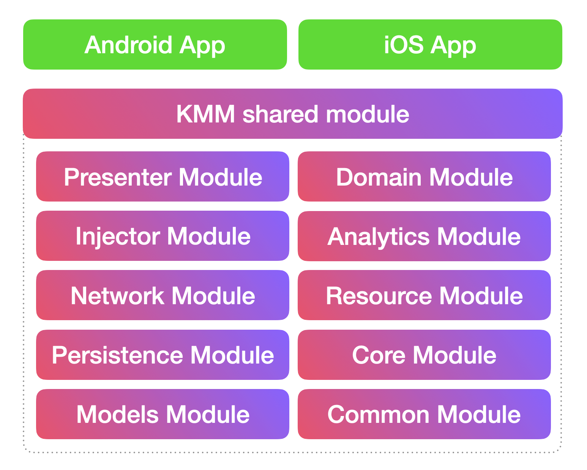
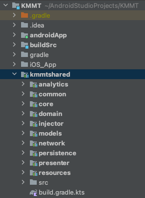

# KMMT : Kotlin Multiplatform Mobile Template

## _Kotlin Multiplatform Mobile Development Simplified_

[](http://kotlinlang.org)
[](https://opensource.org/licenses/MIT)
[](https://kotlinlang.org/lp/mobile/)

KMMT is a Multi-Module KMM based project template designed to simplify the KMM development. It uses a simplified approach that can be
shared both in android and iOS easily. This template include network module, persistence module, resource module, analytics module ( with ios native library integration), domain module, presenter module etc.

_Primary objective of this project is to help KMM Developers & promote KMM technology_

[](https://kotlinlang.org/lp/mobile/)

#### KMMT Module Structure





Credits : [KaMP Kit]

https://user-images.githubusercontent.com/9760688/116871405-d2815b80-ac31-11eb-89cd-cbc92dd42d8c.mp4

https://user-images.githubusercontent.com/9760688/116871609-24c27c80-ac32-11eb-93bb-387b4f5918c2.mp4

##### IDE Requirements

IntelliJ/Android Studio - Android & Shared Module

Xcode - iOS Project

## ✨Features ✨

#### 1. Simple Networking API  ( [Ktor] )
#### 2. Async Task Helper ( [Kotlinx.Coroutines] )
#### 3. Multiplatform Bundle : Object Passing B/W Activities or ViewControllers
#### 4. Platform Blocks
#### 5. Object Serialization Helper ( [Kotlinx.Serialization] )
#### 6. Key Value Store ( [Multiplatform Settings] )
#### 7. LiveData & LiveDataObservable ( [LiveData] )
#### 8. Observe with DBHelper ( Local Database : SQLite - [SQLDelight] )
#### 9. Useful Functional Programming
#### 10. Data Cache Helper
#### 11. Persistence Module - Database ( [Realm] & [SQLDelight] ) and Key Value Store ( [Multiplatform Settings] )
#### 12. Injector Module - Dependency Injection ( [Koin] )
#### 13. Resource Module - strings and colors ( [MokoResources] )
#### 14. Analytics Module - _Mixpanel_ and _UXCam_ ( iOS & Android Native Library Integrated )

### 1. Simple Networking API  ( [Ktor] )

Create API Services using BaseAPI class. All network responses are wrapped in *Either* data type

```kotlin
class JsonPlaceHolderServiceAPI : BaseAPI() {

    override val baseUrl: String
        get() = "https://jsonplaceholder.typicode.com/"

    suspend fun getPosts(postId: Int): Either<List<PostModel>, NetworkFailure> {
        return doGet("comments?postId=$postId")
    }

    suspend fun setPost(post: PostModel): Either<PostModel, NetworkFailure> {
        return doPost("comments", post)
    }
}
```

```kotlin
class BreedServiceAPI : BaseAPI() {
    override val baseUrl: String
        get() = "https://dog.ceo/"

    suspend fun getBreeds(): Either<List<Breed>, NetworkFailure> {
        return doGet<BreedResult>("api/breeds/list/all").flatMap { breedResult ->
            //Converting BreedResult to List<TBreed>
            Either.Success(
                breedResult.message.keys
                    .sorted().toList()
                    .map { Breed(0L, name = it.toWordCaps(), false) }
            )
        }
    }
}
```

### 2. Async Task Helper ( [Kotlinx.Coroutines] )

Run code (Networking calls, Heavy calculations, Large dataSets from local DB, etc..) in Background thread and get the
result in UI thread.

```kotlin
runOnBackground {
    //Code to execute in background
}
```

Return value from background

```kotlin
runOnBackgroundWithResult {
    //Code to execute in background with return
}.resultOnUI { result ->

}

or

runOnBackgroundWithResult {
    //Code to execute in background with return
}.resultOnBackground { result ->

}
```

```kotlin
class PostViewModel(view: LoginView) : BaseViewModel<LoginView>(view) {

    fun getPostsFromAPI() {

        runOnBackgroundWithResult {
            JsonPlaceHolderServiceAPI().getPosts(1)    //getPost returns data so return statement is not needed
            //or 
            // return@runOnBackgroundWithResult JsonPlaceHolderServiceAPI().getPosts(1)
        }.resultOnUI {
            getView()?.showPopUpMessage(
                "First Post Details",
                "Username : ${it.first().name}\n email : ${it.first().email}"
            )
        }
    }

    fun savePost() {

        val post = PostModel("Post Body", "jit@ccc.com", 100, "Jitty", 6)

        runOnBackgroundWithResult {
            JsonPlaceHolderServiceAPI().setPost(post)
        }.resultOnUI {
            getView()?.showPopUpMessage("Saved Post Details", "Name : ${it.name}\n email : ${it.email}")
        }
    }
}
```

### 3. Multiplatform Bundle : Object Passing B/W Activities or ViewControllers

View Model can pass objects & values from Activity to Activity (Android) or ViewController to ViewController (iOS)

###### Send Values From 1st View Model

```kotlin
   // 1st View Model 

var userModel = UserModel("jittya@gmail.com", "Jitty", "Andiyan")

var bundle = Bundle {
    putStringExtra(HomeViewModel.USER_NAME, username.toString())
    putSerializableExtra(HomeViewModel.USER_OBJECT, userModel, UserModel.serializer())
}

getView()?.navigateToHomePage(bundle)


// 1st View 

fun navigateToHomePage(bundle: BundleX)


// 1st Activity : Android

override fun navigateToHomePage(bundle: BundleX) {
    openActivity(HomeActivity::class.java, bundle)
    finish()
}

// 1st ViewContoller : iOS

func navigateToHomePage (bundle: BundleX) {
    openViewController(newViewControllerName: "HomeViewController", bundle: bundle)
}

```

###### Retrieve Values From 2nd View Model

```kotlin
   // 2nd View Model 

class HomeViewModel(view: HomeView) : BaseViewModel<HomeView>(view) {

    companion object BundleKeys {
        const val USER_NAME = "USERNAME"
        const val USER_OBJECT = "USEROBJ"
    }

    override fun onStartViewModel() {

        getBundleValue<String>(USER_NAME)?.let { username ->

        }
        getBundleValue<UserModel>(USER_OBJECT)?.let { userModel ->

        }
    }
}
```

### 4. Platform Blocks

Execute anything specific to a particular platform using Platform Blocks

```kotlin

runOnAndroid {

}

runOniOS {

}

```

### 5. Object Serialization Helper ( [Kotlinx.Serialization] )

Use **_toJsonString_** and **_toObject_** functions for instant serialization.

_Objects to String Serialization_

```koltin
        var userModel = UserModel("jittya@gmail.com", "Jitty", "Andiyan")
        
        var jsonString = userModel.toJsonString(UserModel.serializer())
```

_String to Object Serialization_

```koltin
        var userModel = jsonString.toObject<UserModel>()
        
        or
        
        var userModel:UserModel = jsonString.toObject()
        
        or
        
        var userModel = jsonString.toObject(UserModel.serializer())
```

### 6. Key Value Store ( [Multiplatform Settings] )

Use **_storeValue_** and **_getStoreValue_** functions for storing and retrieving Key-Value respectively

_Storing **Key-Value** pair_

```koltin
        var userModel = UserModel("jittya@gmail.com", "Jitty", "Andiyan")
        
        storeValue { 
            putString("Key1","Value")
            putBoolean("Key2",false)
            putSerializable("Key3",userModel,UserModel.serializer())
        }
```

_Retrieve **Value** using **Key**_

```koltin
        var stringValue = getStoreValue<String>("Key1")
        
        or
        
        var stringValue:String? = getStoreValue("Key1")
        
        var boolValue = getStoreValue<Boolean>("Key2")
        
        var userModel = getStoreValue<UserModel>("Key3",UserModel.serializer())
```

### 7. LiveData & LiveDataObservable ( [LiveData] )

LiveData follows the observer pattern. LiveData notifies Observer objects when underlying data changes. You can
consolidate your code to update the UI in these Observer objects. That way, you don't need to update the UI every time
the app data changes because the observer does it for you.

```koltin
        //Sources
        var premiumManager = PremiumManager()
        var premiumManagerBoolean = PremiumManagerBoolean()

        //Create Observer & Observe
        var subscriptionLiveDataObservable = observe<String> {
           getView()?.setSubscriptionLabel(it)
        }
        
        //Adding Sources
        subscriptionLiveDataObservable.addSource(premiumManager.premium())

        or
        
        //Adding Sources with converter (Boolean to String)
        subscriptionLiveDataObservable.addSource(premiumManagerBoolean.isPremium()){
            if (it)
            {
                return@addSource "Premium"
            }else{
                return@addSource "Free"
            }

        }

        //Update source states
        premiumManager.becomePremium()

        premiumManagerBoolean.becomeFree()

        premiumManager.becomeFree()

        premiumManagerBoolean.becomePremium()

```

```koltin
class PremiumManager {
    private val premium = MutableLiveDataX<String>()
    fun premium(): LiveDataX<String> {
        return premium
    }

    fun becomePremium() {
        premium.value = "premium"
    }

    fun becomeFree() {
        premium.value = "free"
    }

}

class PremiumManagerBoolean {
    private val premium = MutableLiveDataX<Boolean>()
    fun isPremium(): LiveDataX<Boolean> {
        return premium
    }

    fun becomePremium() {
        premium.value = true
    }

    fun becomeFree() {
        premium.value = false
    }

}
```

### 8. Observe with DBHelper ( Local Database : SQLite - [SQLDelight] )

Use 'asFlow()' extension from DBHelper class to observe a query data

```kotlin
class BreedTableHelper : DBHelper() {

    fun getAllBreeds(): Flow<List<TBreed>> =
        localDB.tBreedQueries
            .selectAll()
            .asFlow()
            .mapToList()
            .flowOn(Dispatchers_Default)


    suspend fun insertBreeds(breeds: List<TBreed>) {
        ...
    }

    fun selectById(id: Long): Flow<List<TBreed>> =
        localDB.tBreedQueries
            .selectById(id)
            .asFlow()
            .mapToList()
            .flowOn(Dispatchers_Default)

    suspend fun deleteAll() {
        ...
    }

    suspend fun updateFavorite(breedId: Long, favorite: Boolean) {
        localDB.transactionWithContext(Dispatchers_Default) {
            localDB.tBreedQueries.updateFavorite(favorite, breedId)
        }
    }

}
```

```kotlin
class BreedViewModel(view: BreedView) : BaseViewModel<BreedView>(view) {

    private lateinit var breedTableHelper: BreedTableHelper
    private lateinit var breedLiveDataObservable: LiveDataObservable<Either<List<TBreed>, Failure>>
    private lateinit var breedListCache: BreedListCache

    override fun onStartViewModel() {

        breedTableHelper = BreedTableHelper()
        breedListCache = BreedListCache(getBackgroundCoroutineScope())

        breedLiveDataObservable = observe { breedList ->
            breedList.either({
                getView()?.showPopUpMessage(it.message)
                getView()?.stopRefreshing()
            }, {
                getView()?.refreshBreedList(it)
                getView()?.stopRefreshing()
            })

        }

        refreshBreedListCache(forceRefresh = false)

        observeBreedsTable()

    }

    private fun observeBreedsTable() {
        //get Data from db with observe (Flow)
        runOnBackground {
            //Each refreshBreedListCache will trigger collect 
            breedTableHelper.getAllBreeds().collect {
                breedLiveDataObservable.setValue(Either.Success(it))
            }
        }
    }

    private fun refreshBreedListCache(forceRefresh: Boolean) {
        breedListCache.cacheData(Unit, forceRefresh)
        { cachedResult ->
            cachedResult.either({
                breedLiveDataObservable.setValue(Either.Failure(it))
            }, {
                println("Cache Table updated : $it")
            })
        }
    }
}
```

### 9. Useful Functional Programming

use *Either* data type to represent a value of one of two possible types (a disjoint union). Instances of *Either* are
either an instance of *Failure* or *Success*

```kotlin
 Either<SuccessType, FailureType>
```

convert or map SuccessType using flatMap or map

```kotlin
var result = doGet<List<UserModel>> {
    apiPath("jittya/jsonserver/users?username=${credentails.username}&password=${credentails.password}")
}

return result.flatMap {
    // convert List to Boolean
    Either.Success(it.any { it.username == credentails.username && it.password == credentails.password })
}
```

use either blocks( *either* or *eitherAsync* [for suspended method support] ) to define failure & success
functionalities

```kotlin
 authenticatedResult.either({
    //Failure
    getView()?.showPopUpMessage(it.message)

}, { isAuthenticated ->
    //Success
    if (isAuthenticated) {

        var userModel = UserModel("jittya@gmail.com", "Jitty", "Andiyan")

        var bundle = Bundle {
            putStringExtra(HomeViewModel.USER_NAME, username.toString())
            putSerializableExtra(HomeViewModel.USER_OBJECT, userModel, UserModel.serializer())
        }

        getView()?.navigateToHomePage(bundle)
    } else {
        getView()?.showPopUpMessage("Login Failed")
    }
})
```

### 10. Data Cache Helper

Use *BaseDataCache<RequestParamType, DataType>* to implement data caching (remote to local). call *cacheData* function
to get and save data

```kotlin
class BreedListCache(backgroundCoroutineScope: CoroutineScope) :
    BaseDataCache<Unit, List<TBreed>>(backgroundCoroutineScope, "BREED_SYNC_TIME") {
    
    override suspend fun getData(param: Unit): Either<List<TBreed>, Failure> {
        //get data from remote (using api)
        return BreedServiceAPI().getBreeds()
    }

    override suspend fun saveData(data: List<TBreed>): Either<Boolean, Failure> {
        //save remote data in Local database
        return try {
            BreedTableHelper().insertBreeds(data)
            Either.Success(true)
        } catch (e: Exception) {
            Either.Failure(DataBaseFailure(e))
        }
    }
}
```

```kotlin
var breedListCache = BreedListCache(getBackgroundCoroutineScope())

private fun refreshBreedListCache(forceRefresh: Boolean) {
    
//    breedListCache.cacheData(Unit, forceRefresh)
//                or
    breedListCache.cacheData(Unit, forceRefresh)
    { cachedResult ->
        cachedResult.either({ failure ->
            println("Cache failed : $failure")
        }, { success ->
            println("Cache updated : $success")
        })
    }
}
```

## How to use

#### Shared Module (Business Logics & UI Binding Methods) :

##### _Step 1 : Define View_

- Create a View interface by extending from BaseView.
- Define UI binding functions in View interface.

```kotlin
interface LoginView : BaseView {

    fun setLoginPageLabel(msg: String)
    fun setUsernameLabel(usernameLabel: String)
    fun setPasswordLabel(passwordLabel: String)
    fun setLoginButtonLabel(loginLabel: String)

    fun getEnteredUsername(): String
    fun getEnteredPassword(): String

    fun setLoginButtonClickAction(onLoginClick: KFunction0<Unit>)

    fun navigateToHomePage(bundle: BundleX)
}
```

##### _Step 2 : Define ViewModel_

- Create a ViewModel class by extending from BaseViewModel with View as Type.
- Define your business logic in ViewModel class.

```kotlin
class LoginViewModel(view: LoginView) : BaseViewModel<LoginView>(view) {
    override fun onStartViewModel() {
        getView()?.setLoginPageLabel("Login : ${Platform().platform}")
        getView()?.setUsernameLabel("Enter Username")
        getView()?.setPasswordLabel("Enter Password")
        getView()?.setLoginButtonLabel("Login")
        getView()?.setLoginButtonClickAction(this::onLoginButtonClick)
    }

    fun onLoginButtonClick() {
        getView()?.showLoading("authenticating...")
        val username = getView()?.getEnteredUsername()
        val password = getView()?.getEnteredPassword()
        checkValidation(username, password)
    }

    fun checkValidation(username: String?, password: String?) {
        if (username.isNullOrBlank().not() && password.isNullOrBlank().not()) {
            val credentials = CredentialsModel(username.toString(), password.toString())

            runOnBackgroundWithResult {
                JsonPlaceHolderServiceAPI().authenticate(credentials)
            }.resultOnUI { authenticatedResult ->
                getView()?.dismissLoading()
                authenticatedResult.either({
                    getView()?.showPopUpMessage(it.message)
                }, { isAuthenticated ->
                    if (isAuthenticated) {
                        var bundle = Bundle {
                            putStringExtra(HomeViewModel.USER_NAME, username.toString())
                        }
                        getView()?.navigateToHomePage(bundle)
                    } else {
                        getView()?.showPopUpMessage(
                            "Login Failed"
                        )
                    }
                })

            }
        } else {
            getView()?.showPopUpMessage("Validation Failed", "Username or Password is empty")
        }
    }
}
```

#### Android Module UI Binding :

##### _Step 3 : Define Android View_

- Create new activity by extending from KMMActivity with ViewModel as Type.
- Implement created View interface in activity.
- Implement all necessary methods from View & KMMActivity.

Implement **_LoginView & Bind UI Controls_**

```kotlin
class LoginActivity : KMMActivity<LoginViewModel, ActivityMainBinding>(), LoginView {

    //Generated Methods from KMMActivity based on LoginViewModel
    override fun initializeViewModel(): LoginViewModel {
        return LoginViewModel(this)
    }

    override fun viewBindingInflate(): ActivityMainBinding {
        return ActivityMainBinding.inflate(layoutInflater)
    }

    //Generated Methods from LoginView
    override fun setLoginPageLabel(msg: String) {
        binding.textView.text = msg
    }

    override fun setUsernameLabel(usernameLabel: String) {
        binding.usernameET.hint = usernameLabel
    }

    override fun setPasswordLabel(passwordLabel: String) {
        binding.passwordET.hint = passwordLabel
    }

    override fun getEnteredUsername(): String {
        return binding.usernameET.text.toString()
    }

    override fun getEnteredPassword(): String {
        return binding.passwordET.text.toString()
    }

    override fun setLoginButtonClickAction(onLoginClick: KFunction0<Unit>) {
        binding.loginBtn.setClickAction(onLoginClick)
    }

    override fun setLoginButtonLabel(loginLabel: String) {
        binding.loginBtn.text = loginLabel
    }

    override fun navigateToHomePage(bundle: BundleX) {
        openActivity(HomeActivity::class.java, bundle)
        finish()
    }
}
```

#### iOS Module UI Binding (Xcode) :

##### _Step 4 : Define iOS View_

- Create new viewcontroller by extending from KMMUIViewController.
- Implement created View interface in viewcontroller.
- Implement all necessary methods from View & KMMUIViewController.

Implement **_LoginView & Bind UI Controls_**

```kotlin
class LoginViewController : KMMUIViewController, LoginView {

    @IBOutlet weak
    var usernameTF: UITextFieldX!
    @IBOutlet weak
    var passwordTF: UITextFieldX!
    @IBOutlet weak
    var textlabel: UILabel!
    @IBOutlet weak
    var loginBtn: UIButton!

    override func viewDidLoad()
    {
        super.viewDidLoad()
        // Do any additional setup after loading the view.
    }

    //Generated Methods from LoginView
    func setLoginPageLabel(msg: String)
    {
        textlabel.text = msg
    }

    func setUsernameLabel(usernameLabel: String)
    {
        usernameTF.placeholder = usernameLabel
    }

    func setPasswordLabel(passwordLabel: String)
    {
        passwordTF.placeholder = passwordLabel
    }

    func getEnteredUsername() -> String
    {
        usernameTF.errorMessage = ""
        return usernameTF.text ?? ""
    }

    func getEnteredPassword() -> String
    {
        return passwordTF.text ?? ""
    }

    func setLoginButtonClickAction(onLoginClick: @escaping() -> KotlinUnit)
    {
        loginBtn.setClickAction(action: onLoginClick)
    }

    func setLoginButtonLabel(loginLabel: String)
    {
        loginBtn.setTitle(loginLabel, for: UIControl.State.normal)
    }

    //Generated Methods from KMMUIViewController
    override func initializeViewModel() -> BaseViewModel<BaseView>
    {
        return LoginViewModel(view: self).getViewModel()
    }

    func navigateToHomePage(bundle: BundleX)
    {
        openViewController(newViewControllerName: "HomeViewController", bundle: bundle)
    }
}
```

##### _Subscribe for upcoming details and features..._


[//]: # (These are reference links used in the body of this note and get stripped out when the markdown processor does its job. There is no need to format nicely because it shouldn't be seen. Thanks SO - http://stackoverflow.com/questions/4823468/store-comments-in-markdown-syntax)

[Ktor]: <https://github.com/ktorio/ktor>

[Kotlinx.Coroutines]: <https://github.com/Kotlin/kotlinx.coroutines>

[SQLDelight]:<https://github.com/cashapp/sqldelight>

[Realm]:<https://github.com/realm/realm-kotlin>

[kotlinx.serialization]:<https://github.com/Kotlin/kotlinx.serialization>

[Multiplatform Settings]:<https://github.com/russhwolf/multiplatform-settings>

[LiveData]:<https://github.com/florent37/Multiplatform-LiveData>

[KaMP Kit]:<https://github.com/touchlab/KaMPKit>

[Koin]:<https://github.com/InsertKoinIO/koin>

[MokoResources]:<https://github.com/icerockdev/moko-resources>
